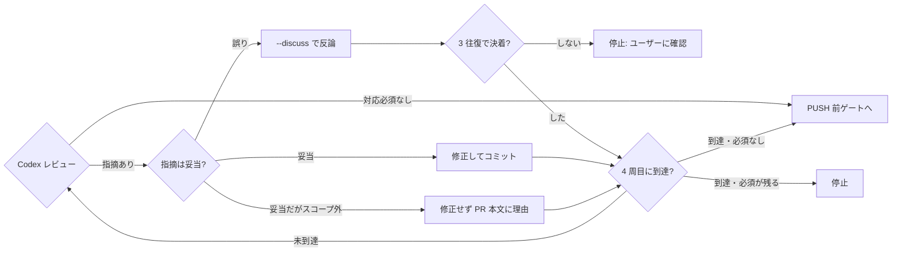
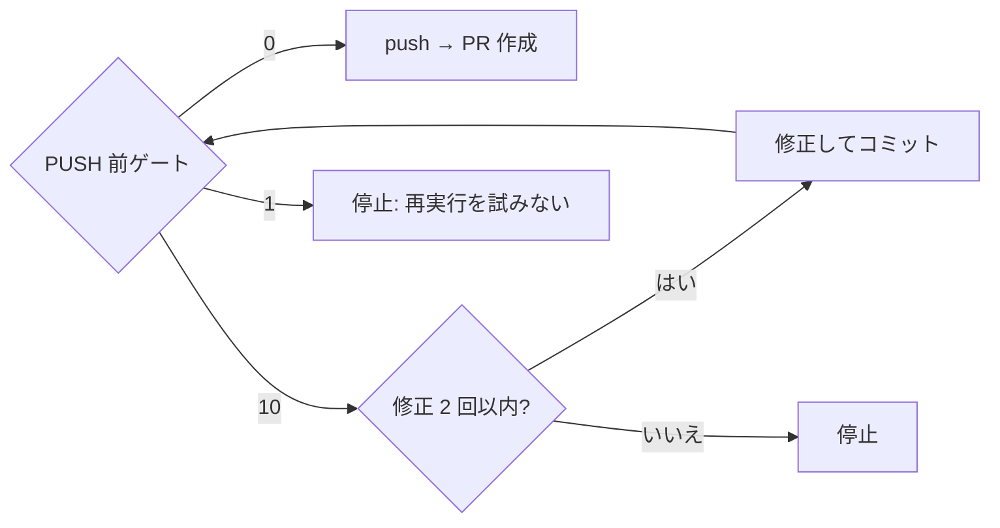
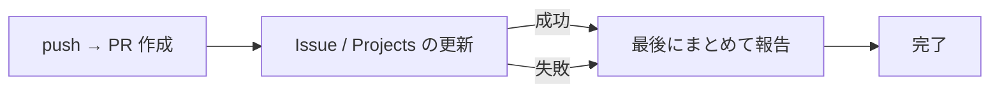

# /gh-fix-issue

Issue 番号 1 つで、Issue 取得から PR 作成までを通すスラッシュコマンド。

```
/gh-fix-issue 3470
```

## 流れ

```
0.  設定読み込み・Codex 疎通確認
1.  Issue 取得（内容を要約して提示）
2.  origin/<base> から作業ブランチを作成
2.5 Issue の Assignee と Projects Status を「着手中」に
3.  実装
4.  セルフレビュー → コミット
5.  Codex レビューループ（最低 1 周・最大 4 周）
6.  PUSH 前ゲート（build / unit test / lint）
6.5 Issue のタスクリストを更新
7.  push → PR 作成
8.  Issue 本文に関連PR、Projects Status を更新
9.  スキップ・失敗したものをすべて報告
```

### 制御フロー

**分岐点だけを図にしている。** 全ステップの一覧は上にあり、図はそれを繰り返さない。

#### Codex レビューのループ

**`--discuss` はラウンドを消費しない。** 図でも `review` に戻らず `round` を経由する。



`--discuss` は `--round` を取らず `findings-<N>.json` も書き換えないため、構造上
ラウンド数が増えようがない。運用の約束ではなくインターフェースで保証している。

#### ゲートの終了コード

`10` は修正へ戻るが、**`1` は戻らない**。



#### メタデータ操作の失敗では止まらない

実装・レビュー・PR という本体の成果を、メタデータ操作の失敗で捨てない。



## 設計上の判断

### リポジトリ固有の値をコマンドに持たせない

base ブランチ・ビルドコマンド・Projects 名は各リポジトリの
`.claude/gh-fix-issue.config.sh` から読む。コマンド本体とスクリプトは
どのリポジトリからも同じものを使う。

設定が無いリポジトリでは、ゲート無し・Projects 更新なしで動く（**ビルドもテストも走らない**）。
`base` は決め打ちしない。`refs/remotes/origin/HEAD` → `gh repo view` の順で既定ブランチを
解決し、どちらからも取れなければ空にして呼び出し側を失敗させる。既定ブランチが `develop` の
リポジトリで `main` を base として扱うと、差分の基準がずれたまま lint 判定が通るため。

雛形は `plugins/gh-fix-issue/presets/gh-fix-issue.config.sh.example`。Gradle / Android なら
`presets/android-gradle.sh` を読み込んで差分だけ上書きできる。プリセットの場所は
設定ファイルから `$GH_FIX_ISSUE_PRESET_DIR` で参照する。
**この場合ビルドもテストも走らない**ので、ステップ 0 で設定の有無を必ず提示する。

### 判定はすべて終了コードで行う

出力の文言で判定しない。スクリプトは次を返す。

| code | 意味 |
|---|---|
| 0 | 合格 |
| 10 | 不合格（直して再実行する対象） |
| 20 | ラウンド上限超過 |
| 30 | 外部ツールが使えない |
| 1 | 実行基盤の失敗（結果全体が信用できない。直して再実行する対象ではない） |

**10 と 1 を区別する**のが要点。10 は「直せば通る」、1 は「判定そのものが信用できない」。
後者を 10 と同じに扱うと、検証されていない状態で緑になる。

### 検証していないものを合格にしない

`PREFLIGHT_SKIP_KTLINT` や `CODEX_REVIEW_FIXTURE` のようなバイパス用の環境変数が
立っているときは警告を出し、PR 本文にも「未検証」と書かせる。
lint レポートが読めなかった場合も、Fatal 0 件と区別できないので失敗させる。

### Codex の指摘は severity に関係なく妥当性を確認する

「対応必須」の表示は severity の機械的な写像で、正しさの保証ではない。
検証せずに直すのも、検証せずに無視するのも誤り。

| 分類 | 対応 |
|---|---|
| 妥当 | severity を問わず修正する |
| 誤り | Codex とディスカッションする。独断で無視しない |
| 妥当だがスコープ外 | 修正せず、理由を PR 本文に書く |

**ディスカッションはレビューのラウンドを消費しない。**
`codex-review.sh --discuss` は `--round` を取らず `findings-<N>.json` も書き換えないため、
構造上ラウンド数が増えようがない。運用の約束ではなくインターフェースで保証している。

3 往復しても決着しなければ停止してユーザーに確認する。押し切らない。

### 止まる条件

実装・レビュー・PR という本体の成果を、メタデータ操作の失敗で捨てない。

**止まる**: 未コミットの変更がある / Issue が曖昧 / ゲートが 2 回直しても通らない /
4 周目で対応必須の指摘が残る / ディスカッションが決着しない / Codex が使えない

**止まらない**（最後にまとめて報告する）: Projects の更新失敗 / Assignee 設定の失敗 /
Milestone が無い / Issue 本文の更新失敗 / PR コメントの投稿失敗

## 各スクリプトの詳細

`plugins/gh-fix-issue/scripts/README.md` を参照。
