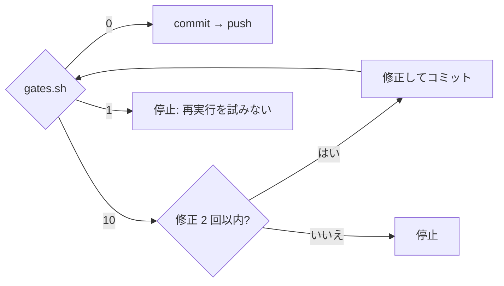
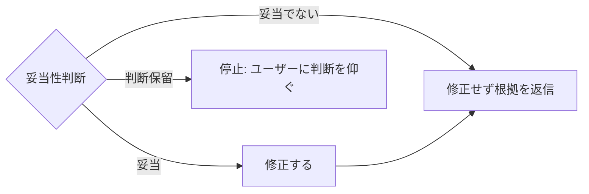
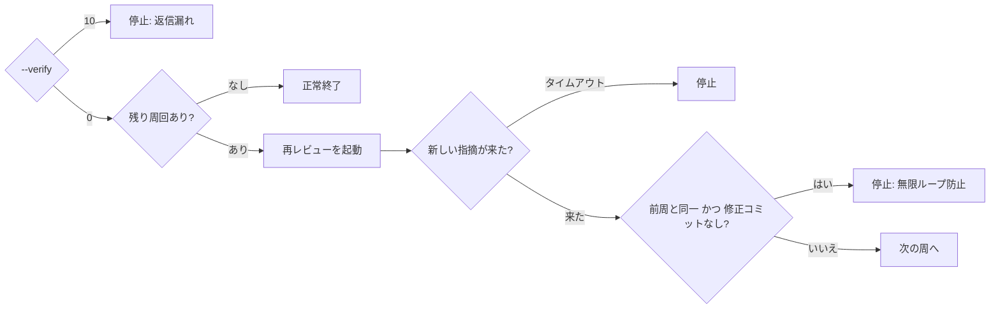

# `/gh-fix-review` 設計

作成日: 2026-08-18（ai-dev-market へ移設: 2026-08-18）

## 1. 目的

GitHub の PR に付いた **Review comment（差分の行に付くコメント）** を取得し、対応・push まで
通したうえで、**各スレッドに必ずインライン返信する**。

```
/gh-fix-review 3479 --loop 3
```

「必ず返信する」をエージェントの善意ではなく**終了コードによる検証**で担保することが、
この設計の中心にある。

## 2. スコープ

含む:

- PR の Review comment のうち未返信スレッドの取得
- **各指摘が妥当かどうかの検証**
- 指摘の分類（対応する / 見送る）とユーザーへの提示
- 修正の実装
- セルフレビューと自己指摘の対応
- PUSH 前ゲート（プラグイン同梱の `gates.sh` を実行する）
- commit と push
- 各スレッドへのインライン返信と、未返信ゼロの検証
- 再レビュー起動（`@claude review`）と結果待ちのループ

含まない:

- **Issue comment（会話タブの通常コメント）への返信** — スレッドが存在せずインライン返信できない
- **Review summary（"Changes requested" の本文）への返信** — 同上
- ローカル Codex の指摘（`findings-<N>.json`）— これは `/gh-fix-issue` の担当
- レビュースレッドの resolve — 閉じる判断はレビュアーのもの
- PR のマージ
- 人間のレビューを待つポーリング — 待ち時間が無限になりうるため

### `/gh-fix-issue` との違い

| | `/gh-fix-issue` | `/gh-fix-review` |
|---|---|---|
| 入力 | GitHub Issue 番号 | 既存 PR の Review comment |
| 指摘の出どころ | ローカルの Codex（GitHub 上に存在しない） | GitHub 上に実在するコメント |
| 出力 | PR の新規作成 | 既存 PR への push とインライン返信 |

指摘が GitHub 上に実在するかどうかが本質的な違いで、返信先が存在するのは後者だけ。

## 3. 全体フロー

| # | ステップ | 担当 |
|---|---|---|
| 0 | `gh` 認証・PR 解決・作業ツリーの確認（`pr-reply.sh --check`） | script |
| 1 | 未返信スレッドの取得（`pr-reply.sh --list`） | script |
| 2 | **各指摘が妥当かを検証する**（§7） | Claude |
| 3 | 「対応する / 見送る」に分類し、ユーザーに提示して**承認を得る** | Claude |
| 4 | 修正の実装 | Claude |
| 5 | セルフレビュー → 自己指摘を対応 | Claude |
| 6 | PUSH 前ゲート（build / test / ktlint） | script |
| 7 | commit → push | Claude |
| 8 | 各スレッドへインライン返信（`pr-reply.sh --reply`） | script |
| 9 | 未返信ゼロの検証（`pr-reply.sh --verify`） | script |
| 10 | **LOOP** 残り周回があれば `@claude review` を投稿し、新しい指摘を待って 1 へ | Claude + script |

ステップ 3 で一度止まる。push と返信はどちらも取り消しにくい外向きの操作であり、
何を直し何を見送るかはユーザーの判断を要するため。ステップ 4 以降は通しで走る。

### 制御フロー

**分岐点だけを図にしている。** 全ステップの一覧は上の表にあり、図はそれを繰り返さない。
詳細（コマンド・回数・文言）は本文だけに置くので、詳細が変わっても図は無効化されず、
**分岐が変わったときだけ図の修正が強制される**。

#### ゲートの終了コード（最も誤解される箇所）

`10` は修正へ戻るが、**`1` は戻らない**。



`1` は「ゲートそのものが実行できていない」状態で、コードを直しても解消しない。
`10` と同じに扱うと、検証できていないまま押し切ることになる。

#### 妥当性判断の3値

3 値のうち「判断保留」だけが流れから外れる。



「妥当でない」も**返信はする**。黙って無視しない。

#### ループの継続と停止



`--verify` の `10` で停止するのが「必ず返信する」の担保。停止条件は 4 つある。

## 4. ファイル構成

```
ai-dev-market/plugins/gh-fix-review/
├── .claude-plugin/plugin.json
└── skills/gh-fix-review/
    ├── SKILL.md          Claude Code 向けの手順
    ├── pr-reply.sh       GitHub API を叩く部分
    ├── threads.jq        スレッド再構成と未返信判定（純粋な変換）
    └── tests/            run-tests.sh + test-*.sh + fixtures/
```

Claude Code プラグインとして配布する（`docs/plugin-distribution.md`）。同梱ファイルの
参照には `${CLAUDE_PLUGIN_ROOT}` を使う。`~/.claude/...` の絶対パスはプラグイン化すると
存在しない。

スクリプトを `plugins/gh-fix-issue/scripts/` **には置かない**。あそこは
「`/gh-fix-issue` フローが使うスクリプト群」と定義された領域であり、
このフローを既存フローから独立させるため。プラグイン自身のディレクトリに同梱する。

## 5. スクリプト インターフェース

```bash
pr-reply.sh --check   [--pr N]                    # 前提確認
pr-reply.sh --list    [--pr N]                    # 未返信スレッドを JSON で出力
pr-reply.sh --reply   <comment_id> --body-file <path>
pr-reply.sh --verify  [--pr N]                    # 未返信が残っていないか
```

`--pr` 省略時はカレントブランチから解決する（`gh pr view --json number`）。

本文を `--body-file` で渡すのは、改行や引用符を含む日本語がシェルで壊れないようにするため。

### 終了コード

| code | 意味 |
|---|---|
| 0 | 未返信なし / 投稿成功 / 前提確認 OK |
| 10 | 未返信あり（一覧を stderr に出す） |
| 30 | `gh` が使えない / PR が見つからない / カレントブランチが PR の head でない / 未コミットの変更がある |
| 1 | 実行失敗 |

`/gh-fix-issue` のスクリプト群と同じ規約に従う。**判定は終了コードで返し、標準出力の
文言では判定しない。**

## 6. 未返信スレッドの判定

REST のみを使う。GraphQL は使わない（`isResolved` も `resolveReviewThread` も
スコープ外のため必要ない）。

```
GET /repos/{owner}/{repo}/pulls/{n}/comments  （--paginate）
```

取得するフィールド: `id` / `in_reply_to_id` / `user.login` / `body` / `path` /
`line` / `original_line` / `position` / `created_at`。

### スレッドの再構成

1. `in_reply_to_id` が null のコメントを**起点**とする
2. それ以外は `in_reply_to_id` を**推移的に**辿って起点に紐付ける

推移的に辿るのは、`in_reply_to_id` が起点を指すのか直前のコメントを指すのかに
依存しないようにするため。どちらでも同じ結果になる。

### 判定規則

| 条件 | 扱い |
|---|---|
| 起点コメントの author が自分 | **対象外**（自分の指摘に自分で返信させない） |
| スレッド内で `created_at` 最大のコメントの author が自分**でない** | **未返信** |
| 同上が自分 | 返信済み |

「自分」は `gh api user --jq .login` で解決する。

この定義により、自分が返信した後に人間が追記すると、そのスレッドは**再び未返信になる**。
往復が自然に続く。

`position` が null（outdated）なスレッドも対象に含める。差分がずれても指摘は指摘であり、
返信自体は可能なため。

### 返信の投稿

```
POST /repos/{owner}/{repo}/pulls/{n}/comments/{起点コメントの id}/replies
```

返信先には**起点コメントの id** を使う。スレッドの途中の id でも投稿できるが、
起点に固定したほうが挙動が読みやすい。

## 7. 指摘の妥当性判断

**修正に着手する前に、各指摘が妥当かどうかを必ず判断する。** レビューコメントは
自動レビューの誤検知や、レビュアーの読み違いを含みうる。指摘されたから直す、という
進め方をしない。

### 判定は 3 値

| 判定 | 意味 | その後 |
|---|---|---|
| 妥当 | 指摘のとおり問題がある | 修正する |
| 妥当でない | 指摘の前提がコードと合っていない | 修正せず、**根拠を添えて返信する** |
| 判断保留 | コードを読んでも確証が得られない | ユーザーに提示して判断を仰ぐ |

### 確認する項目

- 指摘が参照している行・シンボルが**実際に存在するか**（outdated な指摘では特に）
- 指摘の前提（「この値は null になりうる」など）がコードと合っているか
- リポジトリの規約（`CLAUDE.md` / `REVIEW.md`）と矛盾しないか
- 指摘のとおり直すと、別の既存挙動を壊さないか

### 規則

**憶測で「妥当」と判定しない。** 必ず該当コードを読んで裏を取る。裏が取れなければ
「妥当でない」ではなく「判断保留」にする。誤った指摘を握りつぶすリスクと、
正しい指摘を見落とすリスクの両方を避けるため。

**「妥当でない」と判断しても、黙って無視しない。** 根拠を添えて必ずインライン返信する。
これは「必ず返信する」という要件の一部であり、レビュアーが反論できる状態にしておくため。

この考え方は `codex-review.sh --discuss`（指摘が誤っていると考えたときに反論して
見解を求める口）と同じ。違いは、あちらがローカル Codex への反論であるのに対し、
こちらは GitHub 上のスレッドへの返信になる点。

## 8. 返信本文

見送る指摘にも**必ず返信する**。「必ずインライン返信」を、対応したものだけの話に
しないため。

対応した場合:

```
<何をどう直したか>

反映: <commit SHA>
```

見送る場合:

```
<なぜ見送るか>
```

指摘が妥当でないと判断した場合:

```
<指摘の前提がコードとどう食い違っているか>

該当箇所: <ファイル:行> の <実際のコード>
```

根拠を示す。「対応不要です」だけで済ませない。

言語はリポジトリの規約に合わせる（このリポジトリなら日本語）。

本文は呼び出し側（Claude）が作る。スクリプトは投稿するだけで、文面の生成には関与しない。

## 9. ループ制御

```
/gh-fix-review [PR番号] [--loop N]        N 省略時は 1
```

1 周 = 「取得 → 分類 → 修正 → セルフレビュー → ゲート → push → 返信 → 検証」。

```
for i in 1..N:
    threads = list_unreplied()

    if threads が空:
        i == 1 なら「対応すべき指摘なし」として終了
        i > 1  なら正常終了
        break

    妥当性検証 → 分類 → ユーザー承認 → 修正 → セルフレビュー → ゲート → commit → push → 返信
    verify で未返信ゼロを確認（残っていたら停止）

    if i == N:
        上限到達として終了

    @claude review を投稿
    新しい review comment の出現を待つ（タイムアウトで停止）
```

### 継続・停止の条件

| 状況 | 挙動 |
|---|---|
| 再取得で未返信ゼロ | 正常終了（残り周回があっても終わる） |
| 未返信あり & 残り回数あり | 次の周へ |
| 未返信あり & 上限到達 | 停止して報告（残った指摘を一覧で出す） |
| 再レビュー後の未返信が前周と同一 & 修正コミットが発生しなかった | 停止（無限ループ防止） |

最後の行は、全ての指摘を「見送り」にした場合に効く。修正が入っていないので
再レビューは同じ指摘を繰り返し、`@claude review` を投げ続けるだけの周回になる。

### 再レビューの起動

`--loop N`（N ≥ 2）のときのみ、周の最後に PR のトップレベルコメントとして
`@claude review` を投稿する。CLAUDE.md §6 のとおり、このリポジトリの
Claude Code Review は手動起動であり、**投稿しない限り再レビューは走らない**。

既定 1 周では投稿しない。マネージドレビューを消費する外向きの操作であり、
明示的に `--loop N` と書いた場合のみのオプトインとする。

### 待ち方

投稿時刻より後に作成された review comment が現れるまでポーリングする。

- 間隔: 20 秒
- タイムアウト: 600 秒（10 分）
- タイムアウトしたら**停止して報告**する（fail closed）

人間のレビューは待たない。待ち時間が数時間〜数日になりうるため。終了時には
「未返信ゼロ / 再レビューは起動済みか未起動か」を明示し、状態が曖昧に終わらないようにする。

## 10. PUSH 前ゲート

**プラグイン同梱の `gates.sh` を実行する。** リポジトリ側の準備は要らない。
3 段階で検証内容を決める。

1. `<repo-root>/.claude/gh-fix-review.gates.sh` があれば委譲する（**任意**。このプラグイン専用の上書き）
2. 無ければプロジェクト形式を検出する（`gradlew` → `./gradlew test` など）
3. 検出できなければ**警告して続行**する（`0` を返す）

段階 1 を用意する理由は速度。実地検証した大規模 Android リポジトリで実測したところ、
狙い撃ちのビルド + 単体テストが **3 秒**に対し、汎用の `./gradlew test` は
**250 秒**だった（触らないフレーバーの kapt まで回るため）。push ごとに走るのでこの差は
無視できない。ただし段階 1 は必須ではなく、無くても段階 2 で動く。

他のプラグイン（`gh-fix-issue` など）のスクリプトを探して呼ばない。片方のプラグインしか
入れていない利用者が壊れる。

| exit | 扱い |
|---|---|
| 0 | 合格。push へ進む |
| 10 | 不合格。原因を直してコミットし、再実行（修正は最大 2 回・実行は最大 3 回） |
| 1 | ゲートの実行基盤自体の問題。直して再実行する対象ではなく、**停止してユーザーに提示** |

段階 3 で `0` が返ったときは「ゲート未実行」を返信本文とユーザーへの報告に明記する。検証していないことを隠さない。

上書きファイルはプラグインごとに独立している（`gh-fix-issue` は
`.claude/gh-fix-issue.gates.sh` を見る）。片方のプラグイン用に置いた定義が
もう片方の動作を変えないようにするため。命名パターンと終了コードの契約は
全プラグイン共通（`docs/plugin-distribution.md` §5）。

## 11. 中断条件

以下に該当したらフローを停止し、ユーザーに提示する。

- 未コミットの変更がある
- `gh` が未認証、または PR が見つからない
- カレントブランチが PR の head ブランチでない
- 指摘の意味が不明瞭で、対応方針を決められない
- 指摘の妥当性が「判断保留」になった（コードを読んでも確証が得られない）
- ゲートが 2 回直しても通らない
- ゲートが exit 1 を返した（実行基盤の問題）
- 再レビュー待ちがタイムアウトした
- `--verify` が push 後も未返信を検出した
- 再レビュー後の未返信が前周と同一で、修正コミットも発生しなかった

## 12. 既存の仕組みとの関係

**このフローは既存のファイルを一切変更しない。**

| 対象 | 扱い |
|---|---|
| `<repo-root>/.claude/gh-fix-review.gates.sh` | **あれば**実行するだけ。中身はリポジトリが決める |
| 他のプラグイン（`gh-fix-issue` など） | **参照しない。** 片方だけ入れた利用者が壊れるため |
| `.claude/settings.json` の hook | 触らない（Stop hook を足さない） |
| `CLAUDE.md` / `REVIEW.md` | 触らない |
| `AGENTS.md` | **作らない** |

### `AGENTS.md` を作らない理由

Codex はリポジトリルートの `AGENTS.md` を自動で読む。これを置くと
`/gh-fix-issue` の Codex レビュー（`codex-review.sh` → `adversarial-review`）でも
読まれ、既存フローで Codex が見る文脈が変わる。`codex-review.sh` が focus text を
明示的に渡している設計は「`AGENTS.md` が無い」ことを前提に書かれている。

そのため **Codex が自動でインライン返信する配線は今回のスコープに含めない**。
`pr-reply.sh` はエージェント非依存の素の CLI であり、Codex からでも人間からでも
同じコマンドで叩ける。自動化の配線は、既存フローへの影響を評価したうえで別途判断する。

## 13. テスト

`plugins/gh-fix-review/skills/gh-fix-review/tests/run-tests.sh` を skill 内に持つ。
`gh-fix-issue` 側の `scripts/tests/` は触らない。CI は
`find plugins -path '*/tests/run-tests.sh'` で発見して実行する。

`PR_REPLY_FIXTURE` にコメント一覧の JSON ファイルを指定すると、`gh` を呼ばずに
判定ロジックを検証できる（`codex-review.sh` の `CODEX_REVIEW_FIXTURE` に倣う）。

検証する項目:

- 起点コメントの author が自分のスレッドが対象外になること
- スレッド最新が自分なら返信済み、他人なら未返信と判定されること
- 自分の返信の後に人間が追記したスレッドが再び未返信になること
- `in_reply_to_id` が起点を指す場合と直前を指す場合で同じ結果になること
- outdated（`position: null`）なスレッドが対象に含まれること
- 未返信ありで `--verify` が 10 を返すこと
- PR が見つからないときに 30 を返すこと

fixture が設定されているときは、そのゲート／判定が**実際の GitHub では検証されていない**
旨を警告として出す（`/gh-fix-issue` の `PREFLIGHT_SKIP_KTLINT` と同じ方針）。

指摘の妥当性判断（§7）は Claude の判断であってスクリプトの機能ではないため、
自動テストの対象にしない。担保するのは SKILL.md の手順と、判断保留を中断条件に
含めていること（§11）。

## 14. ai-dev-market への移設（完了）

実際の利用リポジトリの PR で実地検証したのち ai-dev-market へ移設した。

**リポジトリ固有の値は設定化せずベタ書きのまま**（YAGNI）で、代わりに SKILL.md の
「リポジトリ固有の設定」セクション1箇所に集約してある。別のリポジトリで使うときは
そのセクションだけを見れば足りる。

| 固有の箇所 | 実装 | 別リポジトリで確認すること |
|---|---|---|
| PUSH 前ゲート | 同梱の `gates.sh` を実行する。`<repo-root>/.claude/gh-fix-review.gates.sh` があれば委譲する | 無くても動く（プロジェクト形式を自動検出。検出できなければ警告して続行） |
| 再レビューの起動 | `@claude review` を投稿する | レビュー運用が違うリポジトリでは既定の `--loop 1` で使う |
| 返信の言語 | 日本語 | そのリポジトリの規約に合わせる |

**`pr-reply.sh` にはリポジトリ固有の要素が無い。** `gh` がカレントディレクトリの remote から
owner/repo を解決するため、どのリポジトリでもそのまま動く。固有なのは SKILL.md 側の手順だけ。

### 移設時に残した課題

- `--check` がローカルと upstream の乖離を検出しない。着手時に未 push コミットがあると
  気づかずに PR へ載る（中断条件は push 後の検査しかない）
- PUSH 前ゲートに docs のみの高速パスが無い。Kotlin 変更ゼロでもキャッシュが無ければ13〜23分かかる
- 未検証の経路: outdated（`position: null`）なスレッドへの返信 / レビュアー追記後に再び 10 になるか /
  投稿失敗時の挙動 / resolve 済みスレッドへの返信
